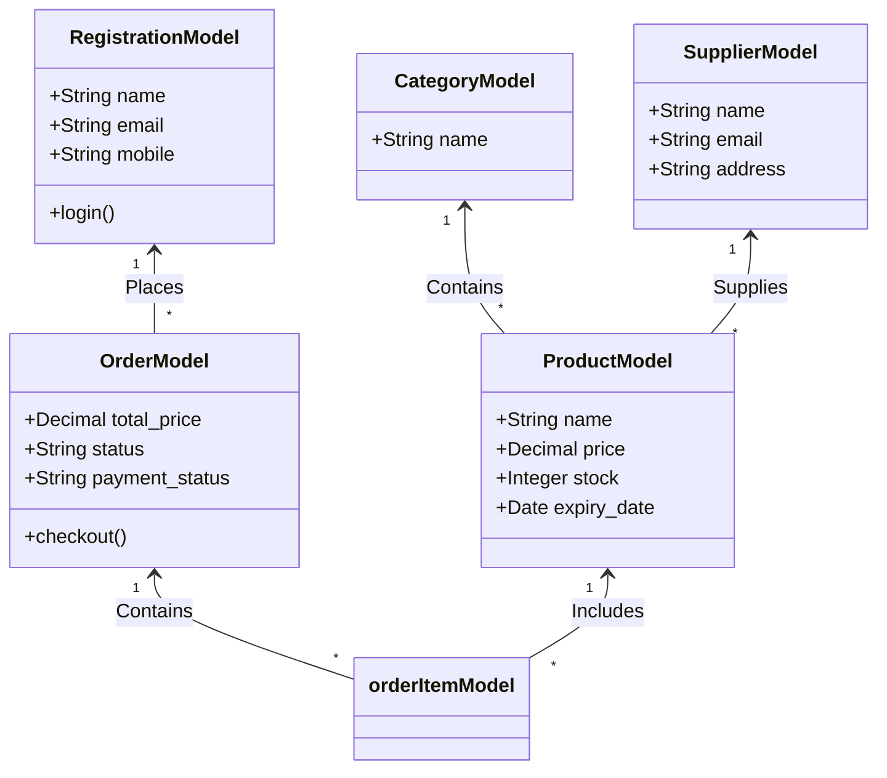
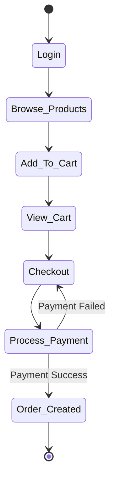

# Pharmacy Management System - Project Documentation

## 4.1. Study the existing system and its limitations
**Existing System:** Many local pharmacies currently use manual ledger books or basic spreadsheet software to track inventory, sales, and supplier data.
**Limitations:**
- High chance of human error resulting in lost revenue or inaccurate stock data.
- Difficulty in tracking expired products, leading to health risks and compliance issues.
- Generating daily or monthly sales reports is time-consuming.
- No automated warnings when product stock falls below the minimum required quantity.

---

## 7. System Design & Database Development
The system is designed as a web-based application utilizing the Model-View-Template (MVT) architecture of Django. 
- **Frontend:** HTML, CSS, JavaScript for responsive UI design.
- **Backend:** Python (Django framework) handling core logic and routing.
- **Database:** Relational Database (SQLite) handling persistent storage of products, users, suppliers, and orders.

---

## 8. Prepare UML Diagrams

### 8.1. Use case diagram
The primary actors interacting with the system are the **Administrator** and the **Customer/User**.

```mermaid
usecaseDiagram
    actor Admin
    actor User

    User --> (Register/Login)
    User --> (View Products)
    User --> (Add to Cart)
    User --> (Place Order)
    User --> (View Order History)

    Admin --> (Login)
    Admin --> (Manage Categories)
    Admin --> (Manage Suppliers)
    Admin --> (Manage Products)
    Admin --> (View All Orders)
    Admin --> (Update Order Status)
```

### 8.2. Class diagram
*This identifies the main system objects and their relationships.*



### 8.3. Activity diagram (Order Placement Process)


---

## 9. Create Data Dictionary
A description of critical database tables:
- **ProductModel:** Stores all medical inventory. Attributes include `name`, `buy_price`, `price`, `stock`, `manufacture_date`, and `expiry_date`.
- **SupplierModel:** Details about wholesale providers. Attributes include `contact_person`, `email`, and `mobile`.
- **OrderModel:** Tracks user purchases. Tracks `total_price`, shipping details, `status` (Placed, Dispatched), and `payment_status`.

---

## 10. Finalize database schema
The schema is successfully finalized using Django ORM and mapped to a relational database. Relationships include Foreign Keys linking Products to Suppliers and Categories, ensuring data integrity across the system.

---

## 11. Development Phase
### 11.1. Start project coding
The environment was set up with Python. Dependencies were initialized, and the Django project (`pharmacy`) and app (`app`) were created.
### 11.2. Design user interface (UI)/screen layouts
Frontend templates were structured to display the Product Dashboard, Cart screens, Checkout pages, and an Admin Panel.
### 11.3. Develop core functionalities and modules
Core modules created: User Authentication, Inventory Management (CRUD operations on Products), and an eCommerce Shopping Cart module.
### 11.4. Begin system integration
The database models, view controllers, and HTML templates were connected. 

---

## 12. Testing & Report Generation
### 12.1. Perform software testing using test cases
Automated Unit Tests were developed utilizing Django's `TestCase` class. The tests successfully setup isolated databases and verify the integrity of Categories, Suppliers, Products, Orders, and View responsiveness.

#### Test Results Summary:
| Test ID | Test Category | Detailed Description | Expected Result | Status |
|---------|---------------|----------------------|-----------------|--------|
| TC-01 | Model Integrity | Verify Category creation and string representation. | Category saved successfully. | PASS |
| TC-02 | Model Integrity | Verify Supplier creation and contact details. | Supplier saved successfully. | PASS |
| TC-03 | Model Integrity | Verify Product creation with Price and Stock data. | Product saved successfully. | PASS |
| TC-04 | Model Integrity | Verify Order creation and association with User. | Order saved successfully. | PASS |
| TC-05 | UI/View | Verify Index page loads with valid HTTP 200 status. | Index page accessible. | PASS |
| TC-06 | UI/View | Verify Product list page loads successfully. | Product page accessible. | PASS |
| TC-07 | UI/View | Verify Product Detail page for a specific product ID. | Details page accessible. | PASS |
### 12.2. Generate system reports
The system backend acts as an endpoint to view overall health metrics of the store, tracking total active stock and order statuses.
### 12.3. Work on future enhancements
Future proposed work includes:
- Adding automated email alerts for expiring product batches.
- Fully operational live payment gateway.
- Implementing a barcode scanning feature for rapid checkout.

---

## 13. Final Documentation & Submission
### 13.1. Prepare project presentation (PPT)
*(To be completed - Use the diagrams and text above to create slides)*
### 13.2. Complete project documentation (Hard Copy)
*(Print this generated document to PDF for the formal documentation submission)*
### 13.3. Obtain completion letter from the company
*(Pending administrative approval)*
### 13.4. Incorporate necessary changes based on feedback
*(Awaiting final review from supervisors/professors)*
